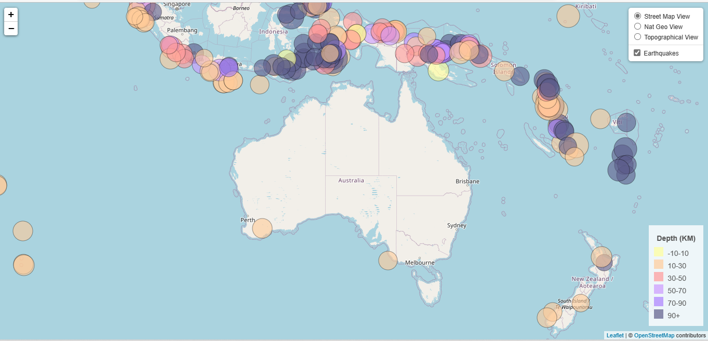
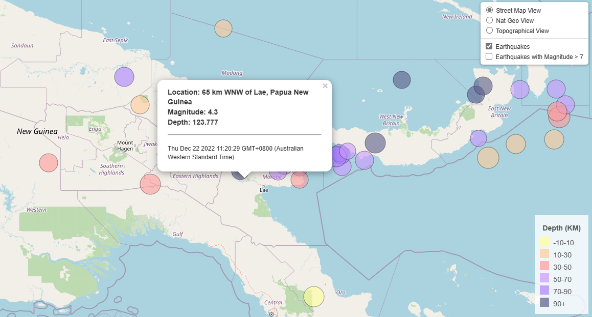

# Mapping Earthquakes around Australia over the past 30 Days

For this challenge, a leaflet application was created to visualise all of the earthquakes that had occurred over the past month. The data was obtained from the United States Geological Survey (USGS)'s GeoJSON Feed (https://earthquake.usgs.gov/earthquakes/feed/v1.0/geojson.php). This site provides a frequently updated datasets that capture an earthquake's location, time, magnitude, and depth over various time spans.

## Overview of Functions

The image above provides a preview of the initial display on the app. This display will reload whenever you refresh the page. There are 3 distinct views provided with the default being the 'Street Map View'. The earthquakes are visualised as circles and presented as a layer over the default map. Earthquakes with higher magnitudes will appear as larger circles. The greater the depth (KM) of the earthquakes, the darker the fill colour of their marker. Users can switch between map views and remove the Earthquake layer by using the panel on the top right corner of the visualisation. The legend located at the bottom right corner provides a summary of the different depths of the earthquakes examined.

If you would like to find out more about a particular earthquake's magnitude, depth, location, and time of occurrence, click on the respective circular marker that is associate with the earthquake. A popup will appear displaying the information.

## Observations & Implications
When this map was built (approx. mid Jan 2023), Australia is fortunate to not have experienced as many earthquakes as their neighbours in the Pacific and South East Asia. Of those that occurred, none were registered at being greater than 5 on the richter scale.

This app can be modified to study other environmental events such as flooding and bushfires. 

## Technologies
- Leaflet.js
- D3.js
- HTML
- CSS

## Acknowledgements
The United States Geological Survey. (n.d.). _Earthquake Hazards Program_: GeoJSON Summary Format. Retrieved January 17, 2022, from https://earthquake.usgs.gov/earthquakes/feed/v1.0/geojson.php.
